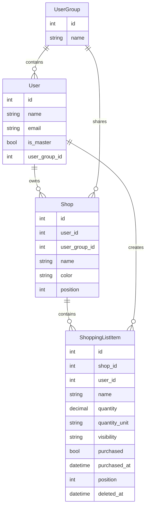

# Llista de la compra per botigues – Especificació actual

**Data:** Març 2026

Aquest document descriu el comportament actual implementat de la llista de la compra a NoCompris. No és una proposta de v1: és una referència funcional del que avui fa l’app.

## 1. Objectiu i abast

La llista de la compra de NoCompris està pensada per mantenir compres compartides amb context de botiga, visibilitat per grup i una experiència ràpida des del mòbil o l’escriptori.

El mòdul actual cobreix:

- dashboard principal agrupat per botigues;
- vista global plana de tots els productes visibles;
- gestió de botigues amb color i ordre;
- productes públics i privats;
- quantitats amb unitat;
- seguiment de comprats i recompra ràpida;
- gestió diferenciada per a usuaris normals i usuaris `master`.

## 2. Context funcional

### 2.1 Accés i rols

- L’entrada principal és per correu electrònic amb codi temporal.
- L’usuari pot demanar recordar la sessió al dispositiu actual.
- Si té 2FA activat, el repte es demana després de validar el codi.
- Els usuaris normals entren al `dashboard`.
- Els usuaris `master` entren al panell `master` i no participen en el flux normal de compra.

### 2.2 Visibilitat compartida

- Les botigues poden ser personals o compartides amb el grup de l’usuari.
- Un usuari veu les seves botigues i també les botigues del seu grup.
- Els productes públics els pot veure qualsevol membre que vegi la botiga.
- Els productes privats només els veu i els edita la persona que els ha creat.

## 3. Model funcional de dades

### 3.1 Botiga (`Shop`)

| Camp | Tipus | Descripció |
|------|-------|------------|
| `id` | bigint PK | Identificador |
| `user_id` | bigint FK | Propietari de la botiga |
| `user_group_id` | bigint FK nullable | Grup amb qui es comparteix |
| `name` | string | Nom visible de la botiga |
| `color` | string | Color de capçalera i accent |
| `position` | int | Ordre visible al dashboard |
| `created_at` / `updated_at` | timestamp | Metadades |

Comportament clau:

- es crea al final de l’ordre visible;
- es pot reordenar entre botigues visibles;
- només la persona propietària la pot editar o eliminar;
- no es pot eliminar si encara té productes pendents visibles per a qui vol esborrar-la.

### 3.2 Producte (`ShoppingListItem`)

| Camp | Tipus | Descripció |
|------|-------|------------|
| `id` | bigint PK | Identificador |
| `shop_id` | bigint FK | Botiga propietària |
| `user_id` | bigint FK | Usuari creador |
| `name` | string | Nom del producte |
| `quantity` | decimal | Quantitat mostrada |
| `quantity_unit` | enum | `u`, `kg`, `g`, `l`, `cl` |
| `visibility` | enum | `public` o `private` |
| `purchased` | boolean | Estat de compra |
| `purchased_at` | timestamp nullable | Data i hora de compra |
| `position` | int | Ordre dins la botiga |
| `deleted_at` | timestamp nullable | Eliminació suau |
| `created_at` / `updated_at` | timestamp | Metadades |

Comportament clau:

- es crea al final de la seva botiga;
- la unitat condiciona el format i si s’accepten decimals;
- els productes públics es poden editar des de qualsevol usuari amb accés a la botiga;
- els productes privats només els pot editar qui els ha creat;
- eliminar un producte és una eliminació suau;
- marcar o desmarcar comprat sincronitza `purchased` i `purchased_at`.

### 3.3 Diagrama de relacions

## 4. Pantalles i comportaments

### 4.1 Dashboard de compra (`/dashboard`)

És la vista principal per a usuaris normals.

Inclou:

- capçalera amb estadístiques de productes pendents i botigues pendents;
- accions globals per mostrar o amagar comprats i crear una botiga nova;
- llistat de botigues ordenat per `position`;
- drag and drop per reordenar botigues visibles;
- cada botiga amb comptador `pendents/total`;
- cada botiga amb modal d’edició i canvi de color;
- acció per afegir productes dins de la botiga;
- drag and drop per reordenar productes visibles;
- toggle per marcar productes com a comprats;
- edició del producte des de modal;
- eliminació suau del producte des de modal.

Regles de visualització:

- per defecte només es mostren productes pendents;
- si s’activa `Mostra comprats`, els comprats apareixen després dels pendents;
- una botiga sense pendents visibles continua mostrant-se, però amb estat atenuat;
- una botiga sense pendents mostra un missatge buit però pot mantenir suggeriments de recompra;
- els productes comprats fa més de 7 dies desapareixen de la vista encara que es mostrin comprats.

### 4.2 Suggeriments de recompra

Cada botiga pot mostrar una secció `Torna a afegir`.

Regles:

- només es construeix amb productes visibles comprats recentment;
- agrupa duplicats pel nom normalitzat;
- no ofereix productes que ja existeixen com a pendents a la mateixa botiga;
- en recomprar, es crea un producte nou pendent mantenint nom, quantitat, unitat i visibilitat;
- la recomanda nova queda al final de la botiga.

### 4.3 Vista global (`/full-shopping-list`)

És una vista plana de tots els productes visibles.

Inclou:

- selector `Organitza per` amb ordre per botiga o ordre alfabètic;
- botó per mostrar o amagar comprats;
- filtres per botiga amb selecció múltiple;
- comptador de productes visibles segons filtres actius;
- toggle de compra directament sobre cada targeta;
- badge de botiga amb color i inicial.

Regles:

- la vista no agrupa productes per botiga;
- quan només es mostren pendents, els comprats queden ocults;
- quan es mostren tots, els pendents continuen abans dels comprats;
- els filtres només treballen amb botigues visibles carregades a la pàgina;
- els comprats antics també queden exclosos perquè la vista reutilitza la mateixa regla de rellevància.

### 4.4 Gestió `master` (`/master`)

És l’espai exclusiu per a usuaris `master`.

Inclou:

- creació de grups;
- alta d’usuaris;
- assignació o desassignació d’usuaris a grups;
- indicació de qui és `master`.

Regles:

- un usuari no `master` rep `403`;
- un usuari `master` és redirigit aquí després d’entrar;
- un usuari `master` no pot crear botigues ni usar el dashboard normal.

### 4.5 Configuració d’usuari

L’app disposa d’un espai de configuració amb:

- perfil;
- canvi de contrasenya;
- aparença;
- autenticació en dos factors.

## 5. Criteris de negoci

### 5.1 Visibilitat

- `Shop::visibleTo()` és la font de veritat de quines botigues es poden veure.
- `ShoppingListItem::visibleTo()` és la font de veritat de quins productes es poden veure.
- La UI no ha de replicar manualment aquestes regles si el model o la policy ja les resol.

### 5.2 Productes comprats

- Un producte comprat continua sent rellevant durant 7 dies.
- Passat aquest termini, deixa de comptar per totals i desapareix de les vistes actives.
- `ShoppingListItem::scopeRelevantForList()` és la regla compartida per dashboard i vista global.

### 5.3 Quantitats i unitats

- `u` es mostra sense decimals útils.
- `kg`, `g`, `l` i `cl` admeten decimals.
- `ShoppingListItem::formattedQuantity()` és la font de veritat del format visible.

### 5.4 Permisos

- `ShopPolicy` governa creació, edició, reordenació i eliminació de botigues.
- `ShoppingListItemPolicy` governa creació, edició, reordenació i eliminació d’ítems.
- Els permisos d’edició d’un producte depenen de si és públic o privat.

## 6. Experiència d’ús

### 6.1 Disseny

- l’app prioritza una UI compacta i directa;
- l’estat principal és pensat per a ús ràpid des del mòbil;
- el color de cada botiga ajuda a reconèixer el context visual.

### 6.2 PWA

NoCompris està preparada com a PWA.

Inclou:

- `manifest.webmanifest`;
- `sw.js`;
- icones PWA;
- pantalla de càrrega global;
- splash screen en dispositius compatibles.

## 7. Referència de proves

Els comportaments descrits en aquest document es validen principalment a:

- `tests/Feature/ShoppingListTest.php`
- `tests/Feature/FullShoppingListTest.php`
- `tests/Feature/MasterAccessTest.php`
- `tests/Feature/Auth/AuthenticationTest.php`
- `tests/Feature/Settings/*.php`
- `tests/Feature/PwaSupportTest.php`

Aquest document s’ha de mantenir alineat amb aquests tests. Si es canvia el comportament i els tests s’actualitzen, aquesta especificació també s’ha d’actualitzar.
