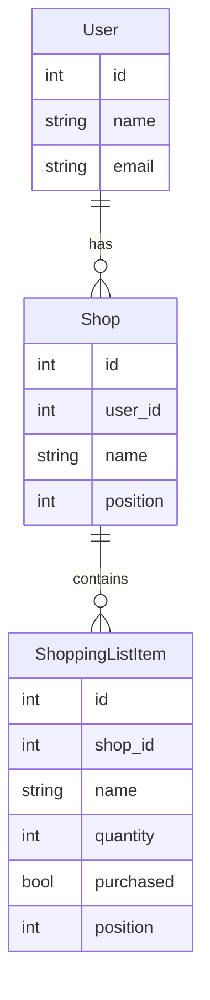

# Llista de la compra per botigues – Especificació

**Data:** Març 2025

---

## 1. Objectius i abast

### 1.1 Funcionalitats mínimes

- Crear, editar i eliminar **botigues** (nom, opcionalment ordre o color).
- Per cada botiga: **afegir productes** (nom de l’ítem i **quantitat**) a la llista.
- **Marcar / desmarcar** productes com a comprats (toggle).

### 1.2 Context tècnic

- **Stack:** Laravel 12, Livewire 4, Flux UI, Alpine.js.
- **Autenticació:** Fortify; totes les dades són per usuari autenticat (les botigues i ítems pertanyen a l’usuari que ha iniciat sessió).

---

## 2. Model de dades

### 2.1 Entitats

**Botiga (Shop)**

| Camp        | Tipus     | Descripció                    |
|------------|-----------|-------------------------------|
| `id`       | bigint PK | Identificador                  |
| `user_id`  | bigint FK | Propietari (usuari)           |
| `name`     | string    | Nom de la botiga              |
| `position` | int       | Ordre de visualització        |
| `created_at` / `updated_at` | timestamp | |

- **Relacions:** un usuari té moltes botigues; una botiga té molts ítems.

**Item de la llista (ShoppingListItem)**

| Camp        | Tipus     | Descripció                          |
|------------|-----------|-------------------------------------|
| `id`       | bigint PK | Identificador                        |
| `shop_id`  | bigint FK | Botiga a la qual pertany l’ítem      |
| `name`     | string    | Nom del producte                     |
| `quantity` | int       | Quantitat (per defecte 1)            |
| `purchased`| boolean   | Si està marcat com a comprat         |
| `position` | int       | Ordre dins la botiga                 |
| `created_at` / `updated_at` | timestamp | |

- **Relacions:** pertany a una botiga.

### 2.2 Diagrama de relacions

### 2.3 Abast de les dades

Les llistes són **per usuari**: totes les botigues i ítems estan associats a `user_id` (via `shops.user_id` i `shops.id` → `shopping_list_items.shop_id`). L’autorització (policies) ha de garantir que un usuari només pugui veure i modificar les seves botigues i ítems.

---

## 3. Pantalles i fluxos

### 3.1 Llista principal

- Llista de botigues (ordenades per `position`).
- Cada botiga es pot **expandir / col·lapsar** per veure o amagar els productes (interacció al client).

### 3.2 Vista per botiga

- **Títol:** nom de la botiga.
- **Llista d’ítems:** cada ítem mostra nom, **quantitat** i checkbox “comprat”.
- **Afegir producte:** camp (o formulari inline) per introduir nom + quantitat i afegir un nou ítem a aquesta botiga.

### 3.3 Gestió de botigues

- **Afegir nova botiga:** acció que obre un formulari (modal o inline) per introduir el nom; opcionalment ordre o color.
- **Editar nom:** edició del nom de la botiga (inline o modal).
- **Eliminar:** eliminar la botiga, amb confirmació si es considera necessari.

### 3.4 Gestió d’ítems

- **Afegir ítem:** nom + quantitat a una botiga concreta.
- **Editar quantitat:** canviar la quantitat d’un ítem existent.
- **Marcar / desmarcar comprat:** toggle que persisteix l’estat.
- **Eliminar ítem:** opcional en la primera versió (v1).

El document es limita a descriure pantalles i accions; els detalls d’implementació (Blade, Livewire, Alpine) es resolen en desenvolupament.

---

## 4. Principis d’interfície (UI/UX)

L’aplicació ha de tenir una **interfície molt neta i fàcil d’utilitzar**.

### 4.1 Neta

- Poc soroll visual.
- Espai en blanc adequat.
- Jerarquia clara: botigues → ítems.
- Només els controls necessaris a la vista.
- Consistència amb Flux UI i el layout existent de l’aplicació.

### 4.2 Fàcil d’utilitzar

- Accions principals evidents (afegir ítem, marcar comprat).
- Mínim de passos per fer les tasques habituals.
- Etiquetes i placeholders clars.
- Feedback ràpid (client-side quan sigui possible).
- Gestió d’errors comprensible.

### 4.3 Implementació

- Fer servir els components Flux existents.
- Tailwind per al layout i l’espaiat.
- Evitar pantalles sobrecarregades o formularis innecessàriament llargs.

---

## 5. Criteri client vs servidor (fluidesa)

Tota la interacció que **no hagi de ser estrictament amb el servidor** es fa **al dispositiu** (Alpine.js) per millorar la fluidesa i la sensació de resposta immediata.

### 5.1 Al servidor (Livewire)

S’usa Livewire **només** quan cal persistir, validar o obtenir dades del servidor:

| Acció | Motiu |
|-------|--------|
| Crear / editar / eliminar botiga | Persistència i autorització |
| Afegir / eliminar ítem (nom + quantitat) | Persistència |
| Editar quantitat d’un ítem | Persistència |
| Marcar o desmarcar “comprat” | Persistència de l’estat |
| Carregar llista de botigues i ítems | Dades des del servidor |

### 5.2 Al client (Alpine.js)

Es fa al client tot el que no requereixi anar al servidor:

- Expandir / col·lapsar seccions de botigues (estat local).
- Obrir / tancar modals o formularis inline (crear botiga, afegir ítem).
- Feedback visual immediat (p. ex. estil del checkbox “comprat” abans o mentre es confirma amb Livewire).
- Edició temporal de text (inline) abans de desar.
- Ordenar visualment (drag), si més endavant s’afegeix, mantenint la persistència amb Livewire.

Això maximitza la interacció al dispositiu i limita Livewire als canvis que requereixen base de dades o lògica al servidor.

---

## 6. Stack i convencions

### 6.1 Backend

- Laravel 12, Eloquent, migracions.
- Policies per autorització (botigues i ítems de l’usuari).

### 6.2 Frontend

- Blade, Flux UI (`flux:`), Alpine.js per l’estat local i la interacció ràpida.

### 6.3 Livewire

- Components puntuals per accions que toquin la base de dades: formularis de botiga/ítem, toggle “comprat”.
- La pàgina principal pot ser una vista Blade que inclou components Livewire on cal.

### 6.4 Rutes

- Tot dins del middleware `auth` (i `verified` si s’aplica).
- Ruta principal tipus `/dashboard` o `/llista` que mostra la llista agrupada per botigues.

---

## 7. Tests (referència)

Es preveu cobrir amb **Pest** (feature tests):

- Creació de botiga.
- Afegir ítem (amb quantitat).
- Editar quantitat d’un ítem.
- Marcar com a comprat.
- Autorització: l’usuari només veu i pot modificar les seves botigues i ítems.

Això es considera criteri d’acceptació; la implementació dels tests es fa en la fase de desenvolupament.

---

## 8. Següents passos (implementació)

1. **Migracions:** taules `shops` i `shopping_list_items` amb els camps i claus foranes indicats.
2. **Models:** `Shop` i `ShoppingListItem` amb relacions i, si cal, casts.
3. **Policies:** autorització per usuari sobre les seves botigues i ítems.
4. **Rutes i controladors / Livewire:** pàgina principal i accions (crear/editar/eliminar botiga, afegir/editar/eliminar ítem, toggle comprat).
5. **Vistes:** Blade + Flux + Alpine segons les pantalles i els principis d’interfície descrits.
6. **Tests:** Pest per les accions i l’autorització.

Aquest document serveix de punt de partida i referència durant tot el desenvolupament.
